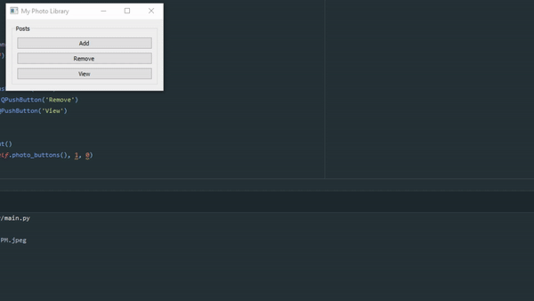

# PyQt-Photo-Library
A Photo Library using PyQt5

# Features
* Add Photos
* Remove Photos
* View Photos
* Saves to temp file location.

## How to run manually
Navigate to the root folder and with your virtual environment running do the following:
1. `git clone https://github.com/IVIURRAY/PyQt-Photo-Library.git`
2. `cd PyQt-Photo-Library`
3. Create/Active your virtual env `source venv/Scripts/activate`
4. `pip install -r requirements.txt`
5. Run `main.py`
